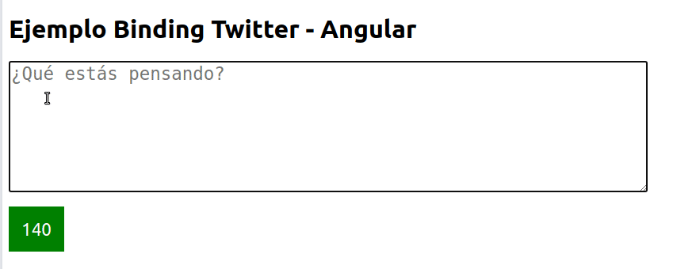

# Twitter en Angular

[](https://github.com/uqbar-project/eg-twitter-angular/actions/workflows/build.yml) [](https://codecov.io/gh/uqbar-project/eg-twitter-angular)

El ejemplo muestra cómo podría funcionar una página de Twitter.

- Queremos replicar el comportamiento de twitter
- Escribimos en un texto, nos dice cuántos caracteres escribimos
- BONUS: que nos diga cuántos caracteres nos quedan
- BONUS 2: mostrarlo con colores distintos. verde si podemos escribir tranquilo, amarillo cuando falten menos de 5 y rojo cuando ya nos pasamos.

Ejercicio extraído de la [guía de binding](https://algo3.uqbar-project.org/gua-prctica-de-ejercicios/ejercicios-binding).



## Variante con template

En la variante con template tenemos 

- un objeto que representa el tweet como **modelo de dominio**. Sabe decirnos cuál es la cantidad de caracteres restantes y si el tweet está excedido o próximo a excederse, pero no conoce la clase css que vamos a utilizar
- el **modelo de la vista** o componente, es el que crea el tweet y luego le delega las preguntas correspondientes. El sí sabe que `pasado`, `limite` y `ok` son los nombres de las clases asociados con diferentes colores.
- la vista mantiene un binding bidireccional contra la propiedad `texto` del `tweet` y además utiliza propiedades calculadas para mostrar los caracteres restantes y el color que le corresponde.

## Variante con signals

- queremos tener un **writable signal texto** que representa el texto del tweet. 
- podríamos tener asociada en la vista el evento `(input)` contra este writable signal, pero eso excluye ciertos eventos que no se disparan, como cuando pegamos texto del portapapeles, o cuando queremos presionar el botón Delete o Backspace. Entonces lo que hacemos en la vista es 1. tener bindeado el valor del textarea contra la propiedad `tweet` del componente ts, 2. disparar una actualización de la signal con cada tecla que se presiona

```html
<textarea id="texto" name="texto" data-testid="texto" placeholder="¿Qué estás pensando?" [(ngModel)]="tweet" (input)="actualizarTweet()"></textarea>
```

```ts
actualizarTweet() {
  this.texto.set(this.tweet)
}
```

- tener un objeto Tweet es engorroso porque si bien podemos delegar muchas de las preguntas, el mecanismo de **computed signals** no funciona si explícitamente no hacemos una llamada a la writable signal. Por ejemplo si nosotros escribimos

```ts
cantidadLetrasRestantes = computed<number>(
  () => this.tweet.cantidadCaracteresRestantes
)
```

donde tweet es un objeto de la clase Tweet, cuando nosotros disparamos un cambio del signal `texto` Angular no recalcula el valor para el computed `cantidadCaracteresRestantes`

- como consecuencia de eso el modelo de la vista toma más responsabilidades. Podríamos generar un Tweet inmutable, de manera que cada vez que escribamos se genere un nuevo objeto Tweet con un texto distinto, pero por el momento no necesitamos tener ese nivel de complejidad para un solo input.